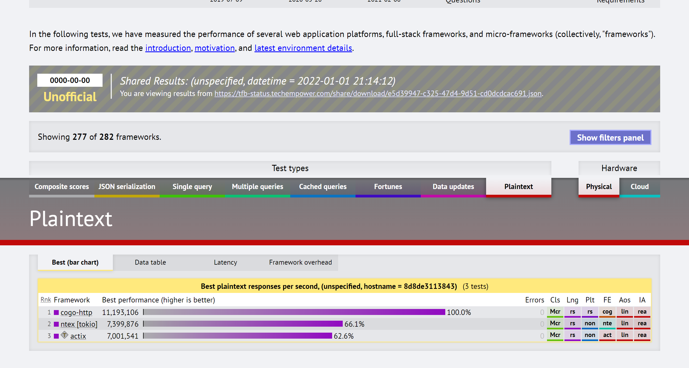

# cogo-http

* Coroutine HTTP framework for Cogo, Original code fork from Hyper，We improved the underlying logic
* support http server
* support http client
## Performance

* platform(16CPU/32 thread AMD Ryzen 9 5950X,32GB mem,Os:Unbutu-20.04)
* [TechEmpowerBench fork project](https://github.com/zhuxiujia/FrameworkBenchmarks)



## example-server
```rust
#[deny(unused_variables)]
extern crate cogo_http;
extern crate env_logger;
extern crate serde_json;

use std::io::Read;
use cogo_http::multipart::mult_part::read_formdata;
use cogo_http::server::{Request, Response};


// read form-data
fn hello(mut req: Request, res: Response) {
    let form = read_formdata(&mut req.body, &req.headers,None).unwrap();
    res.send(serde_json::json!(form.fields).to_string().as_bytes()).unwrap();
}

fn main() {
    env_logger::init().unwrap();
    let _listening = cogo_http::Server::http("0.0.0.0:3000").unwrap()
        .handle(hello).unwrap();
    println!("Listening on http://127.0.0.1:3000");
}
```

## example-client
```rust
extern crate cogo_http;
extern crate env_logger;

use std::env;
use std::io;

use cogo_http::Client;
use cogo_http::header::Connection;

fn main() {
    env_logger::init().unwrap();

    let mut url = "http://www.baidu.com".to_string();

    let client = Client::new();

    let mut res = client.get(&url)
        .header(Connection::close())
        .send().unwrap();

    println!("Response: {}", res.status);
    println!("Headers:\n{}", res.headers);
    io::copy(&mut res, &mut io::stdout()).unwrap();
}
```
